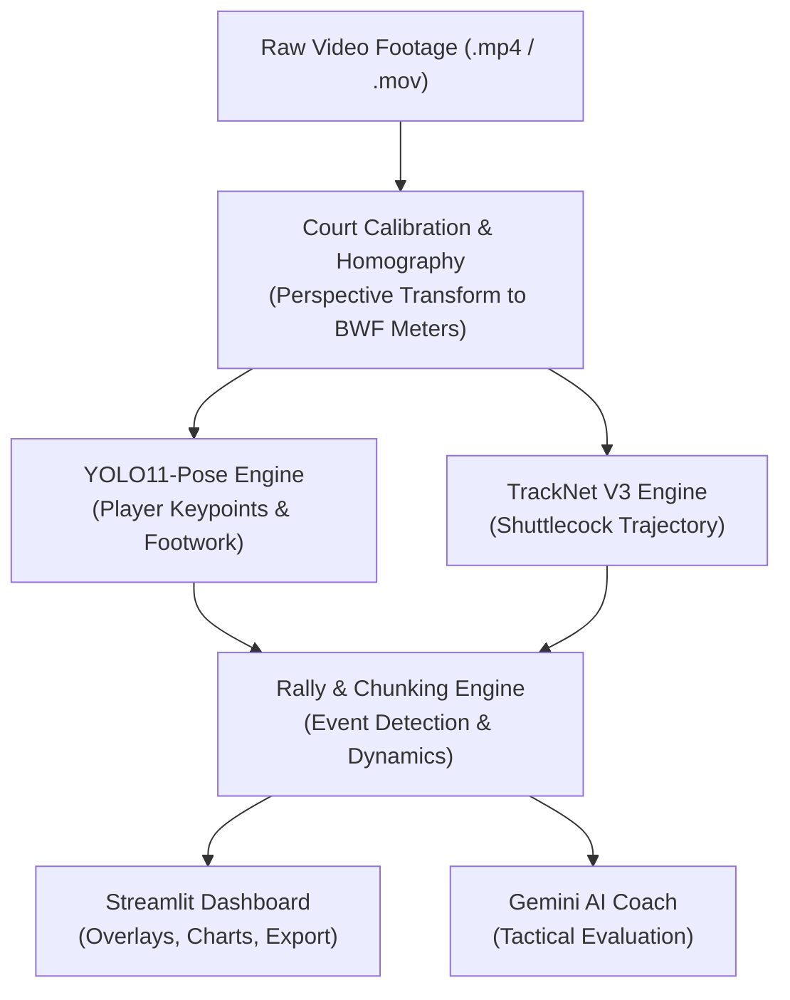

# 🏸 Badminton AI: Intelligent Singles Analytics & Coaching Engine

[](https://www.python.org/)
[](LICENSE)
[](https://streamlit.io/)
[](https://github.com/ultralytics/ultralytics)
[](https://pytorch.org/)
[](https://ai.google.dev/)

**Badminton AI** is an end-to-end computer vision and artificial intelligence engine designed for single-player badminton match analysis. It transforms raw video footage (lateral or high-back angle) into detailed tactical feedback, player movement metrics, and automated coaching recommendations.

---

## 🌟 Key Features

- **Interactive Court Homography Calibration**:
  - Calibrate perspective using interactive 4-corner court selection.
  - Computes precise homography transformation matrices to map pixel coordinates into real-world meters according to standard BWF court dimensions ($13.4\,\text{m} \times 5.18\,\text{m}$ for singles).
- **Player Pose & Footwork Tracking**:
  - Powered by **YOLO11-Pose** with optional **TensorRT acceleration** for high-throughput inference on CUDA-enabled GPUs.
  - Extracts skeletal landmarks (ankles, knees, hips, and center of mass) to evaluate player speed, footwork stance, and split-step execution.
- **High-Speed Shuttlecock Tracking**:
  - Employs **TrackNet V3** with temporal 3-frame stacking and heatmap peak estimation to locate the shuttlecock even during high-velocity smashes and frame occlusions.
- **Rally "Chunking" & Tactical Event Engine**:
  - Automatically identifies camera cuts, shot exchanges, and rally boundaries.
  - Deconstructs player movements into tactical chunks: `Preparation` $\rightarrow$ `Shot` $\rightarrow$ `Recovery`.
  - Measures recovery offset relative to the **Dynamic Base Position** rather than static court center.
- **Gemini-Powered AI Coach**:
  - Tactical analysis summarizing rally trajectories, shot distributions, recovery efficiency, and movement biases.
  - Generates clear, actionable coaching points and tailored training suggestions.
- **Reactive Streamlit Dashboard**:
  - Visual video overlays with trajectory trails and player skeletons.
  - Speed charts, distance metrics, shot distribution plots, and downloadable annotated video clips and JSON match reports.

---

## 🏗️ Architecture Pipeline



---

## 🚀 Getting Started

### 1. Prerequisites

- **Python**: 3.10 or newer (tested with Python 3.10 - 3.12)
- **FFmpeg**: Required for video transcoding and slice extraction
- **CUDA / TensorRT (Recommended)**: For real-time inference acceleration on NVIDIA GPUs

### 2. Installation

Clone this repository and create a virtual environment:

```bash
git clone https://github.com/divyaprakash0426/badminton-ai.git
cd badminton-ai

# Create virtual environment
python3 -m venv .venv
source .venv/bin/activate

# Install dependencies
pip install -r requirements.txt
```

### 3. Model Weights Setup

1. **YOLO11 Pose**:
   - The default model is `yolo11x-pose.pt` (or `yolo11n-pose.pt`).
   - If not present locally, Ultralytics will automatically download the standard weights on initial run.
   - TensorRT engines (`.engine`) can be exported automatically on compatible NVIDIA hardware for faster processing.

2. **TrackNet V3 Weights**:
   - Place TrackNet model checkpoints in `engine/tracknet_v3/ckpts/`:
     - `TrackNet_best.pt`
     - `InpaintNet_best.pt`
   *(If weights are absent, the engine falls back to pose-only tracking with warning notices).*

### 4. Running the Dashboard

Launch the Streamlit dashboard:

```bash
streamlit run app.py
```

Open your browser at `http://localhost:8501`.

---

## 📖 Usage Guide

1. **Upload Video**: In the sidebar, upload an MP4, MOV, or AVI singles match video.
2. **AI Coach Setup (Optional)**: Provide a Google Gemini API Key in the sidebar to enable automated tactical coaching feedback.
3. **Calibrate Court**:
   - Use the slider to find a frame with clear court view.
   - Adjust the 4 green pins to align with the 4 corners of the singles court boundary lines.
4. **Run Analysis**: Click **"Process Video"** to begin batch vision inference.
5. **Inspect Results**:
   - **Video Overlay Tab**: Watch the analyzed video with tracking lines, shot points, and player skeletons.
   - **Tactical Analysis Tab**: Explore total distance, maximum speed, shot distribution charts, and per-rally clip breakdown.
   - **AI Coach Tab**: Review tactical feedback generated by Gemini.

---

## 📁 Repository Structure

```
badminton-ai/
├── app.py                      # Main Streamlit dashboard application
├── blueprint.md                # System design & architecture blueprint
├── requirements.txt            # Python dependencies
├── engine/
│   ├── tracker.py              # YOLO11-Pose & TrackNet V3 wrappers
│   ├── geometry.py             # Homography transforms & coordinate math
│   ├── analysis.py             # Rally segmentation, event detection & chunking
│   ├── action_recognition.py   # Shot classification logic
│   ├── gemini_coach.py         # Gemini AI tactical coaching interface
│   └── tracknet_v3/            # TrackNet V3 neural network implementation
├── project_utils/
│   ├── parallel_processor.py   # Multi-threaded batch video processing
│   ├── security.py             # Safe file upload handling & validation
│   ├── video.py                # Frame extraction & video metadata
│   └── video_io.py             # Asynchronous GPU/CPU video writing
├── training/                   # Model training utilities and scripts
├── tests/                      # Verification scripts and unit tests
└── CoachAI-Projects/           # Reference datasets and benchmark tooling
```

---

## 🤝 Contributing

Contributions are welcome! If you have suggestions for improvements, optimizations, or new features:

1. Fork the Project
2. Create your Feature Branch (`git checkout -b feature/AmazingFeature`)
3. Commit your Changes (`git commit -m 'feat: Add some AmazingFeature'`)
4. Push to the Branch (`git push origin feature/AmazingFeature`)
5. Open a Pull Request

---

## 📄 License

This project is licensed under the MIT License - see the [LICENSE](LICENSE) file for details.

---

## 🏸 Acknowledgements

- [TrackNet V3](https://github.com/qaz810677/TrackNetV3) for shuttlecock trajectory tracking research.
- [Ultralytics YOLO11](https://github.com/ultralytics/ultralytics) for high-performance player pose estimation.
- [CoachAI](https://github.com/CoachAI-Challenge) for badminton research benchmarks and dataset structures.
